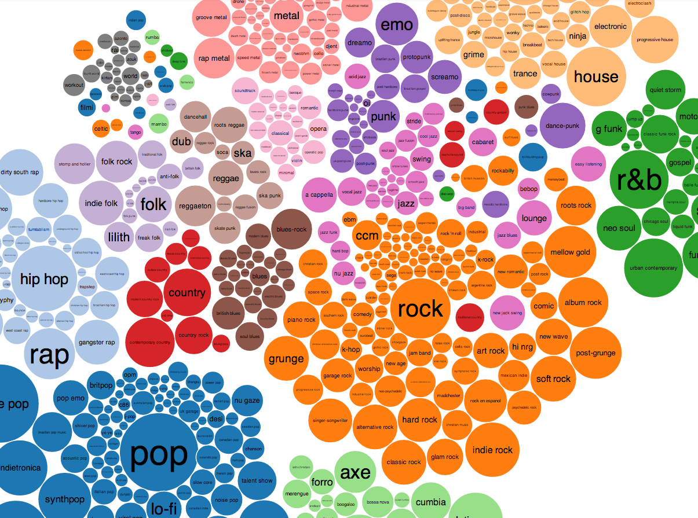
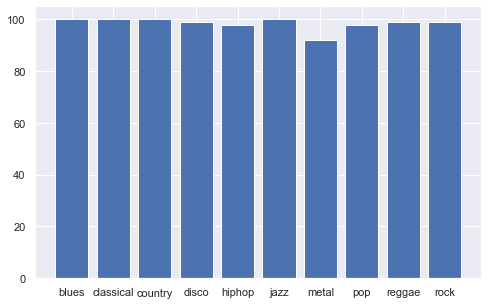
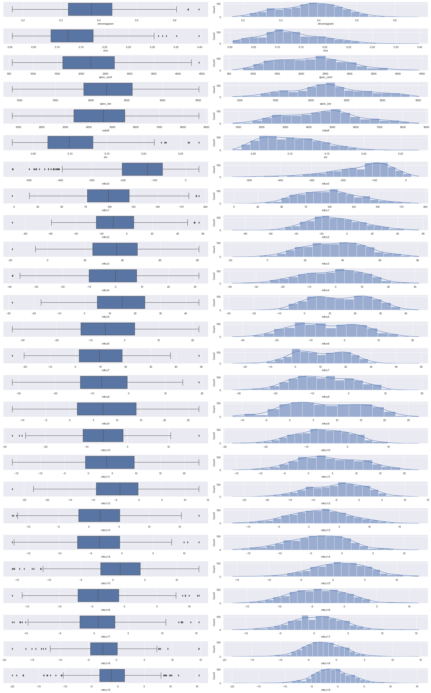
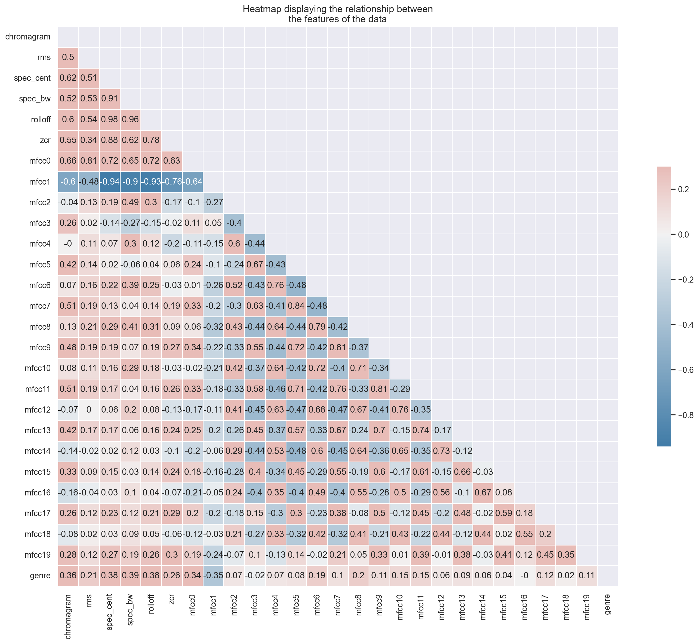
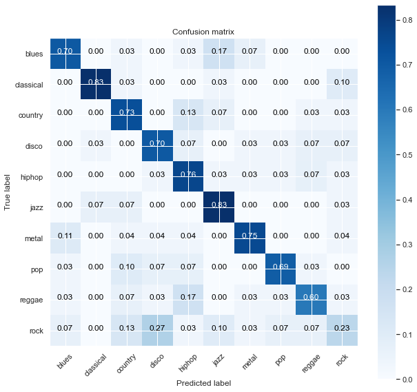

# MusicClassifier
## Table of Contents
[Overview](#overview) 
[Data Retrieval](#data-retrieval) 
[Feature Extraction](#feature-extraction) 
[Data Preparation](#data-preparation) 
[Exploratory Data Analysis](#exploratory-data-analysis) 
[Machine Learning](#machine-learning) 
[Summary](#summary) 
[Future Questions](#future-questions) 
[References](#references) 

## Overview
Music is everywhere. As of 2011, it was reported that there are over 79,000,000 documented songs in existence[1](http://bedtimemath.org/fun-math-songs-in-world/). These songs have been classified into hundreds of different genres and subgenres.

And yet, music is still constantly evolving. Some new genres that are expected to see major growth in 2021 are Synthwave, Ambient music, J-pop, and Nu Disco[3](https://www.ujam.com/blog/upcoming-music-trends-in-2021/). With this constant growth and expansion, it's important for businesses that work with music to be able to reliably track these updates.

This project aims to generate accurate and reproducible machine learning models that can predict a song's genre based on its audio features.

## Data Retrieval
In order to conduct this project, I require music data that contains genre labels. The solution I found was through the GTZAN[4](http://marsyas.info/downloads/datasets.html) dataset. It consists of 1000 audio tracks, each 30 seconds long. It contains ten genres: blues, classical, country, disco, hip-hop, jazz, reggae, rock, metal, and pop. Each genre consists of 100 sound clips.

## Feature Extraction
Before training the classification model, raw data has to be transformed from audio samples into more meaningful representations. Every audio signal consists of many features. However, we must extract the characteristics that are relevant to the problem we are trying to solve.

For extracting such audio features, I use Librosa[5](https://librosa.org/doc/latest/index.html) Python module.

The final dataset contains the mean value of each of the following <b>26 features</b>:
Chroma Frequencies, Root Mean Square, Spectral Centroid, Spectral Bandwidth, Spectral Rolloff, Zero Crossing Rate, 20 Mel-Frequency Cepstral Coefficients

Once the features are extracted, existing classification algorithms can be used to classify the songs into different genres, to see which one works best.

## Data Preparation
After briefly examining the data, we can notice that there are songs that appear multiple times in different genres in the dataset. This makes sense as songs can be classified into multiple genres. This did prove problematic, however, since my machine learning models would only be able to handle single-label classification.

In order to remedy this, I remove the duplicates shrinking my dataset down from 1000 songs to 985 songs. This, in turn, imposed some minor class imbalances with the largest classes having 100 songs while the smallest class contained 92 songs.

| # of Samples for Genre |
:-------------------------:|

## Exploratory Data Analysis
I started my EDA by doing an univariate analysis, finding Skewness and Kurtosis of each feature and then plotting box-plot and data distribution.

| Univariate Analysis |
:-------------------------:|

After verifying the results, I further check the distribution of data for each feature by doing a multivariate and a univariate normality test, from which it turns out that only a few of the features follows a nearly normal distribution.

I then continue by doing a multivariate analysis and by creating a correlation matrix, looking for relationships between different audio features.

| Multivariate Analysis |
:-------------------------:|

| Audio Features Correlation Matrix |
:-------------------------:|

It turns out that there are actually quite a few strong correlations observed between the different features (e.g. between <i>rolloff</i> and <i>spectral centroid</i>).

## Machine Learning
I apply a 70-30 stratified train-test splitting of the dataset, on which I test kNN, Logistic Regression, Decision Tree, Random Forest, Gradient Boosting, and 3 different versions of Support Vector Machines classifiers. As a scoring metric, I use the <i>accuracy</i>. The baseline is given by the Dummy classifier, which scores 10.14%. Out of the box, the Logistic Regression and SVM classifiers perform the best by 64.86% accuracy on the test set. The Decision Tree model, on the other hand, starts at a more modest 47.64%. 

I therefore decide to continue testing the models that work best (Logistic Regression, Gradient Boosting, SVM and Nu-SVM), this time on a dataset with a reduced dimensionality of the feature space obtained by removing those that are strongly correlated, keeping one of each pair. This reduction results in an improvement in the performance of each classifier, with the Gradient Boosting reaching up to 67.23%.

After tuning the hyperparamaters for the different models by a 10-fold cross-validated grid-search, the highest accuracy is achieved by the <b>Nu-SVM</b> model, which scores an average of 68.65% in the cross-validation and a <b>68.24% accuracy</b> on the test set. The results can be seen below in the multiclass confusion matrix.

[]

## Summary

The goal of this project is to predict the genre of a song based on its audio features. In a machine learning context, this is a multiclass classification problem.

The final dataset that was used to train and test the machine learning models in this project consisted of 1000 songs spanning 10 different genres.

The models I tested in this project were kNN, Logistic Regression, Decision Tree, Random Forest, Gradient Boosting, and 3 different versions of Support Vector Machines. The supervised machine learning model that performed the best was the Nu-Support Vector classifier[6](https://scikit-learn.org/stable/modules/generated/sklearn.svm.NuSVC.html) with an accuracy of 68.24% on the whole test set, reaching 89.12% on a specific subset of it.

## Future Ideas

This project gave a good baseline for genre classification on single label classification. While this is useful, we know that songs can have multiple genres. Songs are not discreet and do not strictly fall into one genre or another. Looking forward, I would like to try to extend this model to perform multi-genre (multi-label) classification.

Another avenue I'm interested in exploring is genre classification directly from raw audio data through Deep Learning techniques. It would be interesting to see if there's enough inherent information in song lyrics to build NLP models that can outperform audio feature models.

If you made it this far, thanks so much for reading!

## References

1. [79,000,000 Song Metric](http://bedtimemath.org/fun-math-songs-in-world/)
2. [Music Genre Visualization](https://musicmachinery.com/2013/09/22/5025/)
3. [2021 Music Genre Trends](https://www.ujam.com/blog/upcoming-music-trends-in-2021/)
4. [GTZAN dataset](http://marsyas.info/downloads/datasets.html)
5. [Librosa Python module](https://librosa.org/doc/latest/index.html)
6. [Nu-Support Vector classifier](https://scikit-learn.org/stable/modules/generated/sklearn.svm.NuSVC.html)